# Alpit Shooter

<h1 align="center">
    

        

            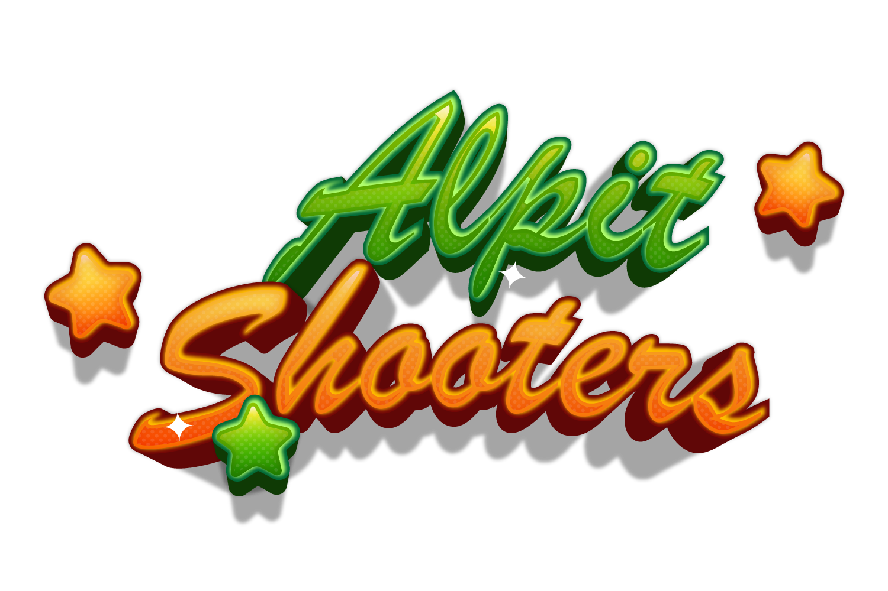
        

    

</h1>

Alpit Shooter is a Third Person Shooter (TPS) set in carnaval event. Player aim to score point by hit on military target in game.

## Game Overview

- *Platform:* Windows 10 64bit or higher
- *Programming Language:* C#
- *Genre:* Third Person Shooter
- *Theme:* Carnival Event

## Features

- Two difficult level: Easy and Normal
- Easy mode have a 2 minutes time to hit the target and get the score
- Normal mode have a 1 minutes time to hit the target and get the score
- Carnival themed 3D graphics
- Immersive sound effects and background music

## Screenshots AlpitShooters V1

<h1 align="center">
    

        

            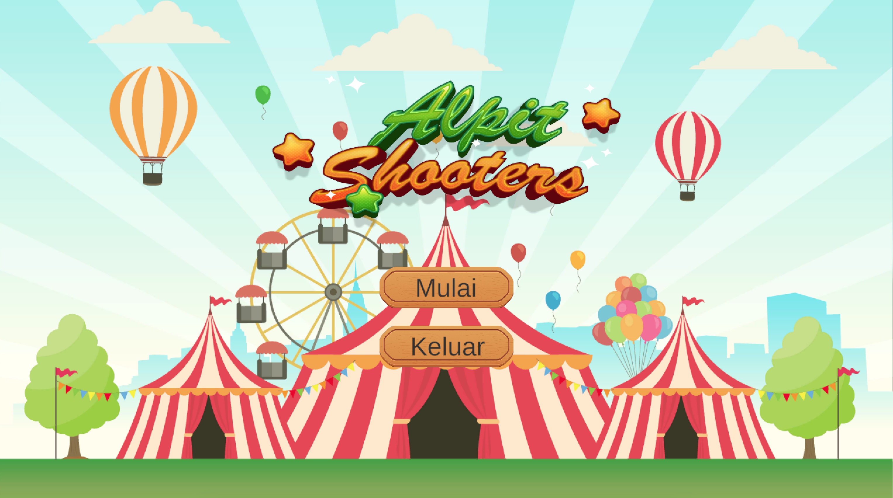
            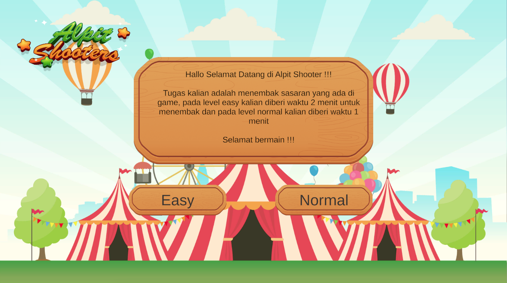
            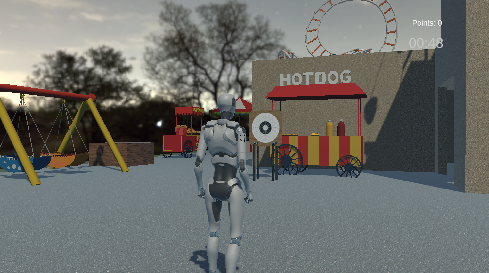
            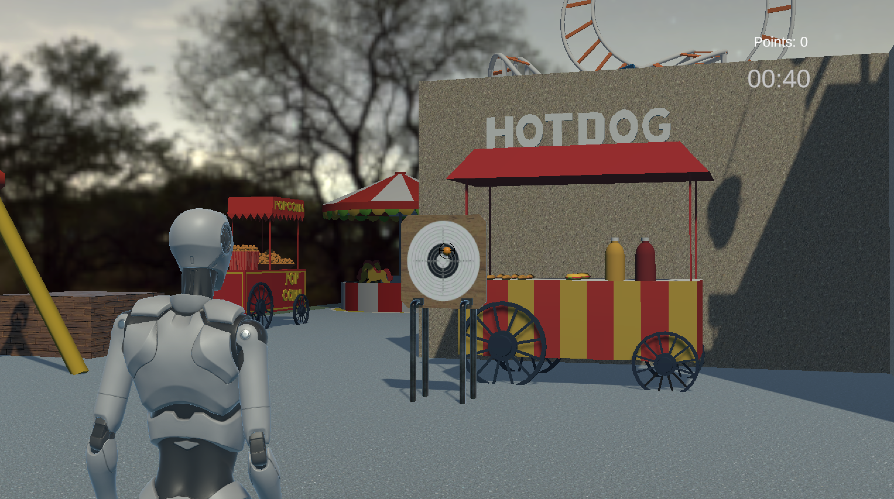
            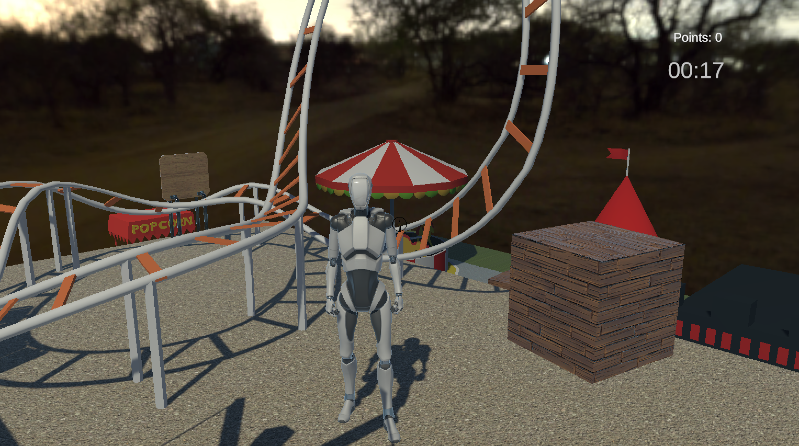
            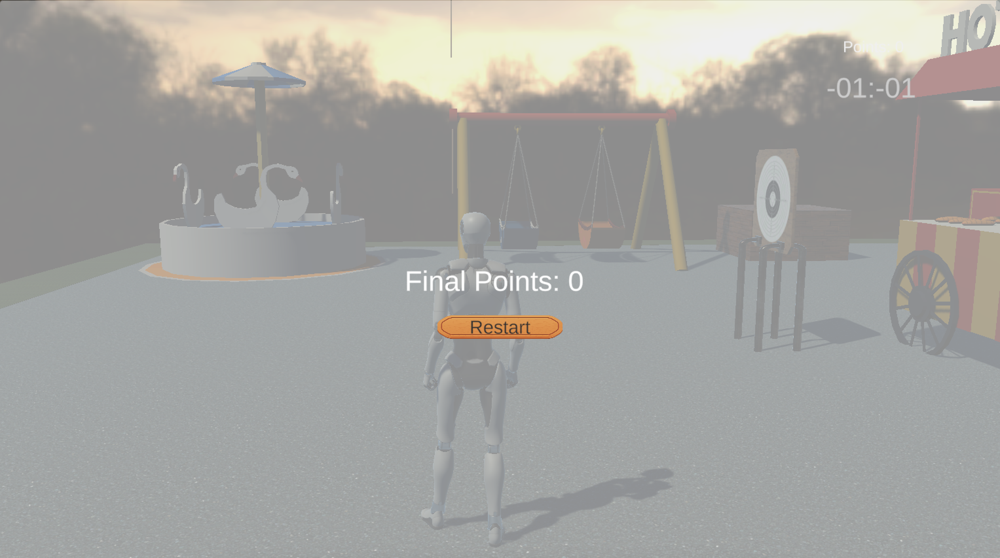
        

    

</h1>

## Screenshots AlpotShooters V2

<h1 align="center">
    

        

            
            
            
            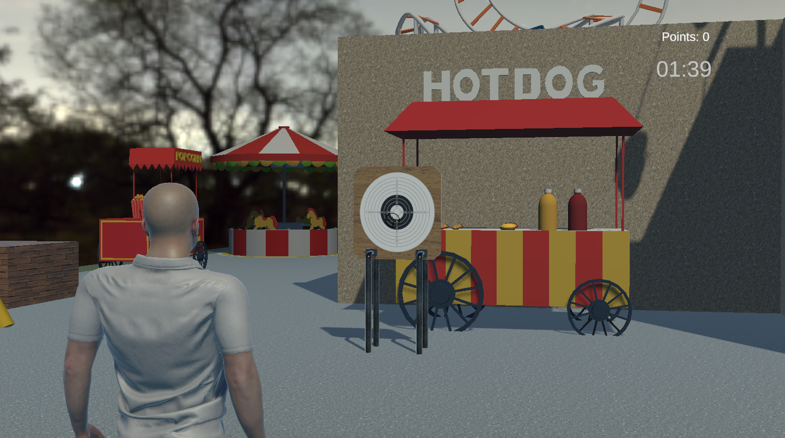
            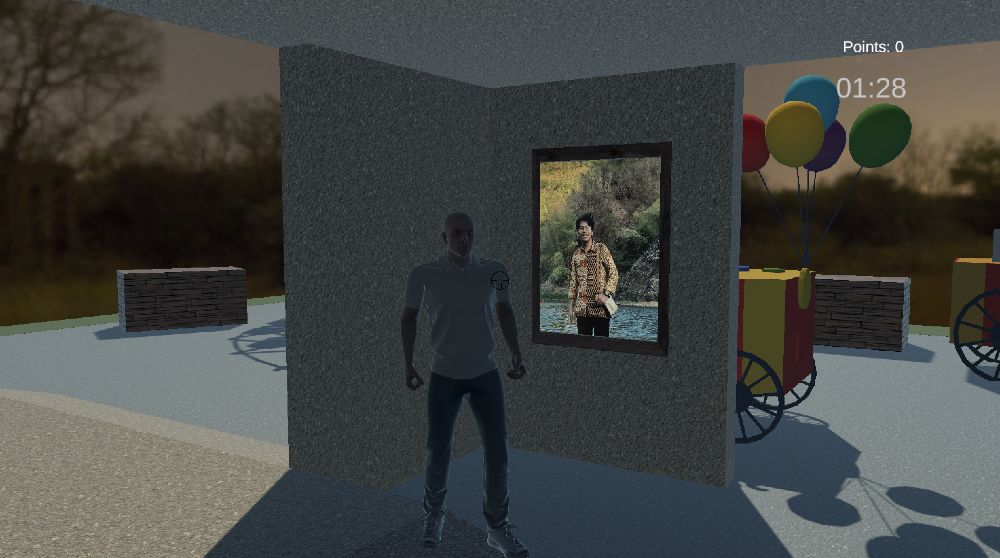
            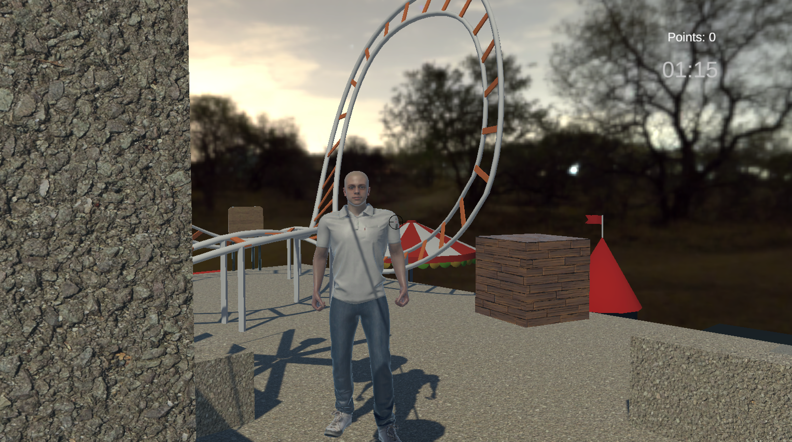
            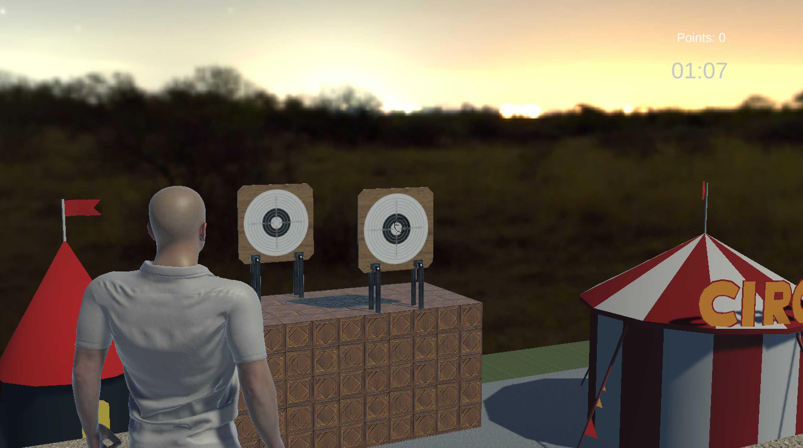
            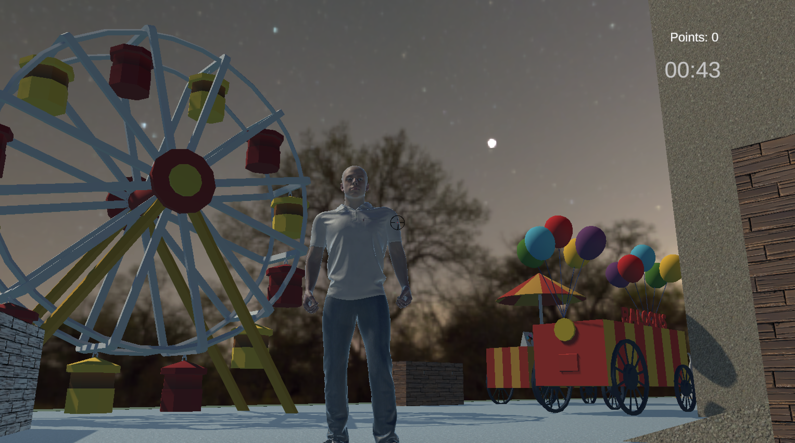
            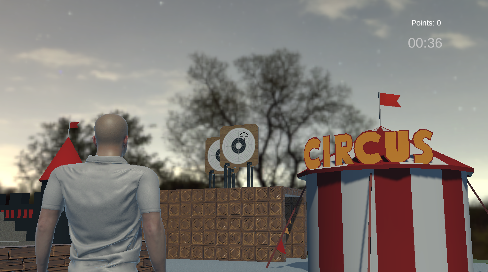
            
        

    

</h1>

## Installation

1. Download the installation packages in GDrive link (https://s.id/AlpitShooter_x64)
2. Extract the files
3. Run "GGame.exe"

### Team

- AHMAD GHOZALI
- MOHAMMAD ZUNDAN ASSYAFI'I NICA PUTRAWAN
- AHMAD RYAN SAFFAH YARTAVICK
- MUHAMMAD FATHUR ALIM RAMADHAN

### Supervising Lecturer

Dr. Ir. Aulia Faqih Rifa'i, M.Kom.

## Links

- [Teaser Video]( )
- [Source_Code](https://s.id/AlpitShooter_SC)
